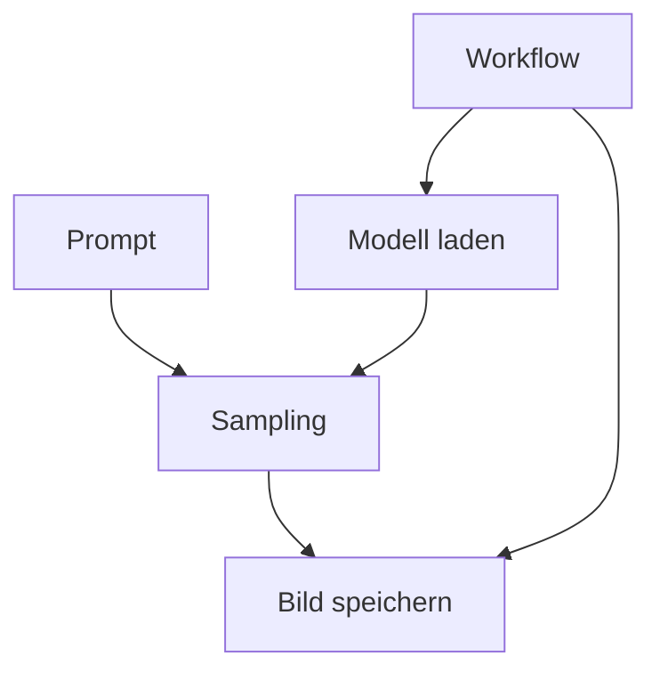

# ComfyUI

[Alle Dienste](../dienste.md) · [Schnellstart](../../SCHNELLSTART.md)

## Was macht der Dienst?

ComfyUI ist ein grafischer Editor für KI-Workflows, beispielsweise zur Bildgenerierung.
Modelle, Textvorgaben und Verarbeitungsschritte werden über verbundene Nodes kombiniert.
Das Repository enthält einen SD-Turbo-Beispielworkflow und eine kleine Modellinstallationsoberfläche.
Die Voreinstellung nutzt ein CPU-Image; eine GPU wird hier nicht automatisch eingebunden.
Der Zugang ist durch Forward Auth geschützt, ohne eigenen SSO-Nutzeradapter.

## Einordnung in diesem Repository

| Punkt | Konfiguration |
|---|---|
| Stack-ID | `comfyui` |
| Browseradresse | `https://comfyui.<DOMAIN>` |
| Direkte Abhängigkeiten | [core](core.md) |
| Anmeldung | Forward Auth; kein nativer SSO-Adapter in diesem Stack. |
| Deklarierte Dienstgruppen | `comfyui-admins`, `comfyui-users` |

`<DOMAIN>` steht für die bei der Einrichtung gewählte Basisdomain.
Abhängigkeiten werden vom Manager ergänzt; weitere indirekte Stacks können dazukommen.
Eine Dienstgruppe regelt den äußeren Zugang, nicht automatisch jede Berechtigung innerhalb der Anwendung.

## Bestandteile

| Compose-Service | Container-Image |
|---|---|
| `comfyui` | `kagurazakanyaa/comfyui:${COMFYUI_VERSION}` |

Image-Variablen werden aus der Stack-Konfiguration aufgelöst.
Die Tabelle beschreibt den Repository-Stand, keine Liste bereits gestarteter Container.

## Zusammenspiel



Das Diagramm zeigt die wesentlichen Beziehungen, nicht jede Netzwerkverbindung.

## Einrichten und starten

Den [Schnellstart](../../SCHNELLSTART.md) einmal für den Host durchführen.
Danach im Manager **Ersteinrichtung** beziehungsweise **Stack-Auswahl ändern** öffnen:

```bash
sudo .venv/bin/python compose/manage.py
```

`comfyui` auswählen und die ermittelten Abhängigkeiten kontrollieren.
Vorhandene Werte werden wiederverwendet; neue Secrets gehören nicht in Git.
Erst nach erfolgreicher Einrichtung mit der Nutzung beginnen.

## Erste Nutzung

1. Die ComfyUI-Seite öffnen und zuerst die verfügbaren Modelle prüfen.
2. Den Beispielworkflow `compose/comfyui/workflows/sd-turbo-cpu.json` in den Editor laden.
3. Fehlende Modelle passend zum Workflow bereitstellen; ein Workflow allein enthält keine Modellgewichte.
4. Mit kleiner Bildgröße und einem kurzen Prompt einen Testlauf starten.
5. Ergebnis prüfen und den angepassten Workflow zusammen mit den verwendeten Modellnamen speichern.

## Wichtige Einstellungen

| Einstellung | Bedeutung |
|---|---|
| `COMFYUI_VERSION` | Gewählter ComfyUI-Image-Tag; Standard `cpu-latest`. |
| `DOMAIN` | Subdomain wird als `comfyui.<DOMAIN>` verwendet. |

Die vollständigen Eingaben stehen in [`.env.example`](../../compose/comfyui/.env.example).
Normale Werte im Manager über **Konfiguration bearbeiten** ändern.
Passwortwechsel sind keine bloßen Textänderungen: Datei und laufender Dienst müssen zusammenpassen.

## Besonderheiten dieser Konfiguration

- Der Standardtag `cpu-latest` ist veränderlich; für reproduzierbare Versuche eine konkrete Version bevorzugen.
- Die Erweiterung `custom_nodes/model-installer-ui` wird schreibgeschützt in den Container eingebunden.
- Die Modellinstallationsoberfläche beschränkt Downloadquellen; sie ist kein allgemeiner Datei-Downloader.
- Das Skript `scripts/install-sd-turbo-cpu.sh` bleibt als gezielte Installationshilfe vorhanden.
- Custom Nodes sind ausführbarer Code; nur tatsächlich benötigte Erweiterungen ergänzen.
- Ein gemeinsamer ComfyUI-Prozess bedeutet nicht automatisch getrennte Arbeitsbereiche pro Authentik-Nutzer.

## Daten und Sicherung

| Volume-Schlüssel | Tatsächlicher Volume-Name |
|---|---|
| `comfyui_data` | `managed_comfyui_data` |

- Das ComfyUI-Datenvolume enthält die zur Laufzeit angelegten Dateien.
- Große Modelldateien erhöhen Sicherungsgröße und Dauer deutlich.
- Wichtige Workflows zusätzlich als JSON exportieren; ein Screenshot bewahrt keine ausführbare Pipeline.

Im Manager **Backups / Import / Export** öffnen und Stack, Service und Mounts auswählen.
Alle benötigten Services berücksichtigen; eine einzelne Service-Auswahl ist kein vollständiges Stack-Backup.
Der Manager hält betroffene Schreiber für Mount-Sicherungen an.
Konfiguration kann zusätzlich mit `age` verschlüsselt gesichert werden.
Vor einer Wiederherstellung Ziel-Mounts und vorhandene Daten prüfen.

## Wenn etwas nicht funktioniert

| Beobachtung | Zuerst prüfen |
|---|---|
| Workflow meldet fehlendes Modell | Modelltyp, Dateiname und Ablageort mit den Nodes abgleichen. |
| Ausführung dauert sehr lange | CPU-Betrieb, Modellgröße und Bildauflösung berücksichtigen. |
| Node fehlt | Prüfen, ob der Workflow zusätzliche Custom Nodes voraussetzt. |
| Modellinstallation scheitert | Speicherplatz, Downloadquelle und Containerlogs prüfen. |

Für den Containerstatus und begrenzte Logs im Repository:

```bash
docker compose --project-directory compose/comfyui --env-file compose/comfyui/.env -p comfyui -f compose/comfyui/compose.yml ps
docker compose --project-directory compose/comfyui --env-file compose/comfyui/.env -p comfyui -f compose/comfyui/compose.yml logs --tail=80
```

Fehlt die `.env`, zuerst die Einrichtung abschließen.
Vor dem Weitergeben von Logs mögliche Zugangsdaten und persönliche Daten entfernen.

## Grenzen und weiterführende Dateien

Diese Seite beschreibt die vorhandene Konfiguration und ersetzt keinen Live-Test.
Ein erfolgreicher Compose-Check beweist weder SSO noch die vollständige Wiederherstellung.

- [Compose-Konfiguration](../../compose/comfyui/compose.yml)
- [Stack-Metadaten und Hooks](../../compose/comfyui/stack.py)
- [Gemeinsame Manager-Funktionen](../manager.md)
- [Ausstehende Betriebsprüfungen](../validierung.md)
