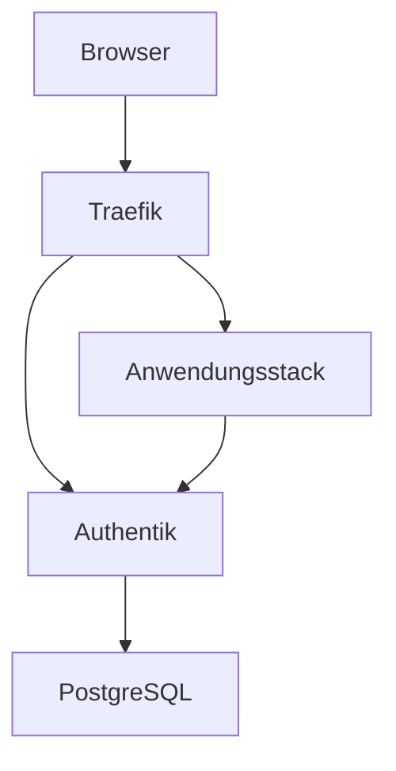

# Core: Traefik und Authentik

[Alle Dienste](../dienste.md) · [Schnellstart](../../SCHNELLSTART.md)

## Was macht der Dienst?

Core ist die gemeinsame Eingangstür für die anderen Stacks.
Traefik verteilt HTTPS-Anfragen an die Anwendungen und verwaltet Zertifikate.
Authentik prüft Benutzer und stellt Anmeldung, Dienstgruppen und SSO bereit.
PostgreSQL speichert die Authentik-Konfiguration.
Ohne diesen Stack funktioniert der vorgesehene externe Zugriff nicht.

## Einordnung in diesem Repository

| Punkt | Konfiguration |
|---|---|
| Stack-ID | `core` |
| Browseradresse | `https://proxy.<DOMAIN>`, `https://auth.<DOMAIN>` |
| Direkte Abhängigkeiten | Keine; gemeinsamer Pflichtstack. |
| Anmeldung | Authentik ist der Identity Provider; Dashboard über Forward Auth. |
| Deklarierte Dienstgruppen | `core-admins` |

`<DOMAIN>` steht für die bei der Einrichtung gewählte Basisdomain.
Abhängigkeiten werden vom Manager ergänzt; weitere indirekte Stacks können dazukommen.
Eine Dienstgruppe regelt den äußeren Zugang, nicht automatisch jede Berechtigung innerhalb der Anwendung.

## Bestandteile

| Compose-Service | Container-Image |
|---|---|
| `traefik` | `traefik:${TRAEFIK_VERSION}` |
| `postgresql` | `postgres:${POSTGRES_VERSION}` |
| `authentik-server` | `ghcr.io/goauthentik/server:${AUTHENTIK_VERSION}` |
| `authentik-worker` | `ghcr.io/goauthentik/server:${AUTHENTIK_VERSION}` |

Image-Variablen werden aus der Stack-Konfiguration aufgelöst.
Die Tabelle beschreibt den Repository-Stand, keine Liste bereits gestarteter Container.

## Zusammenspiel



Das Diagramm zeigt die wesentlichen Beziehungen, nicht jede Netzwerkverbindung.

## Einrichten und starten

Den [Schnellstart](../../SCHNELLSTART.md) einmal für den Host durchführen.
Danach im Manager **Ersteinrichtung** beziehungsweise **Stack-Auswahl ändern** öffnen:

```bash
sudo .venv/bin/python compose/manage.py
```

`core` ist bereits verpflichtend ausgewählt; zusätzliche Anwendungen nach Bedarf wählen.
Vorhandene Werte werden wiederverwendet; neue Secrets gehören nicht in Git.
Erst nach erfolgreicher Einrichtung mit der Nutzung beginnen.

## Erste Nutzung

1. Beim ersten Einrichten Domain, ACME-Mailadresse und Image-Versionen festlegen.
2. Den einmal angezeigten Authentik-Erstzugang im Passwortmanager speichern.
3. Benutzer im Manager anlegen; anschließend die benötigten Dienstgruppen zuweisen.
4. Eine freigegebene Anwendung über ihre Subdomain öffnen und die Anmeldung testen.
5. Das Traefik-Dashboard unter `https://proxy.<DOMAIN>/dashboard/` zur Routenkontrolle verwenden.

## Wichtige Einstellungen

| Einstellung | Bedeutung |
|---|---|
| `DOMAIN` | Gemeinsame Basisdomain; DNS muss auf diesen Host zeigen. |
| `ACME_EMAIL` | Kontaktadresse für Zertifikate. |
| `ACME_CA_SERVER` | ACME-Verzeichnis; Test- und Produktivbetrieb bewusst unterscheiden. |
| `TRAEFIK_ACME_VOLUME` | Name des persistenten Zertifikatsvolumes. |

Die vollständigen Eingaben stehen in [`.env.example`](../../compose/core/.env.example).
Normale Werte im Manager über **Konfiguration bearbeiten** ändern.
Passwortwechsel sind keine bloßen Textänderungen: Datei und laufender Dienst müssen zusammenpassen.

## Besonderheiten dieser Konfiguration

- Der Manager wählt `core` immer aus; es ist kein optionaler Zusatzdienst.
- `auth.<DOMAIN>` ist die Anmeldeseite und darf nicht selbst hinter derselben Anmeldeschranke hängen.
- Authentik-Outpost-Rückwege sind notwendige Ausnahmen; normale Anwendungsrouten bleiben geschützt.
- `core-admins` erlaubt den Dashboard-Zugriff, ist aber nicht automatisch eine Authentik-Superuser-Rolle.
- Gruppen werden ohne Mitglieder angelegt; das erste Administratorkonto erhält nicht pauschal jeden Dienstzugriff.
- Benutzer und Dienstgruppen über den Manager ändern, damit die Anwendungshooks mitlaufen.

## Daten und Sicherung

| Volume-Schlüssel | Tatsächlicher Volume-Name |
|---|---|
| `postgresql_data` | `managed_core_postgresql_data` |
| `authentik_data` | `managed_core_authentik_data` |
| `traefik_acme` | `${TRAEFIK_ACME_VOLUME}` |

- Authentik-Datenbank und Authentik-Dateidaten gemeinsam berücksichtigen.
- Das ACME-Volume enthält Zertifikatsmaterial; bei Wiederherstellung seine Zuordnung beibehalten.
- ENV, Secrets und Manager-Zustand gehören zur Wiederanlaufplanung; Manager-Zustand wird nicht automatisch als normales Stack-Volume gesichert.

Im Manager **Backups / Import / Export** öffnen und Stack, Service und Mounts auswählen.
Alle benötigten Services berücksichtigen; eine einzelne Service-Auswahl ist kein vollständiges Stack-Backup.
Der Manager hält betroffene Schreiber für Mount-Sicherungen an.
Konfiguration kann zusätzlich mit `age` verschlüsselt gesichert werden.
Vor einer Wiederherstellung Ziel-Mounts und vorhandene Daten prüfen.

## Wenn etwas nicht funktioniert

| Beobachtung | Zuerst prüfen |
|---|---|
| Anmeldeseite nicht erreichbar | DNS, Port 443, Traefik und den Authentik-Server prüfen. |
| Zertifikatsfehler | Domain, ACME-Mailadresse und Erreichbarkeit von Port 80 prüfen. |
| Anmeldung klappt, Anwendung verweigert Zugriff | Mitgliedschaft in der passenden Dienstgruppe prüfen. |
| Einrichtung abgebrochen | Manager-Status lesen und Einrichtung mit den vorhandenen Werten wiederholen. |

Für den Containerstatus und begrenzte Logs im Repository:

```bash
docker compose --project-directory compose/core --env-file compose/core/.env -p core -f compose/core/compose.yml ps
docker compose --project-directory compose/core --env-file compose/core/.env -p core -f compose/core/compose.yml logs --tail=80
```

Fehlt die `.env`, zuerst die Einrichtung abschließen.
Vor dem Weitergeben von Logs mögliche Zugangsdaten und persönliche Daten entfernen.

## Grenzen und weiterführende Dateien

Diese Seite beschreibt die vorhandene Konfiguration und ersetzt keinen Live-Test.
Ein erfolgreicher Compose-Check beweist weder SSO noch die vollständige Wiederherstellung.

- [Compose-Konfiguration](../../compose/core/compose.yml)
- [Stack-Metadaten und Hooks](../../compose/core/stack.py)
- [Gemeinsame Manager-Funktionen](../manager.md)
- [Ausstehende Betriebsprüfungen](../validierung.md)
