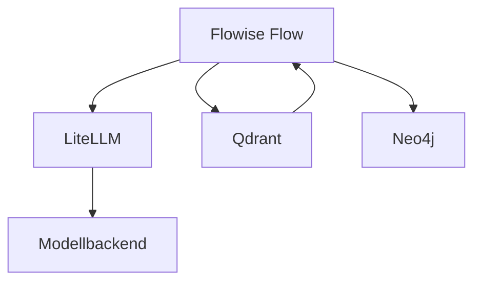

# Flowise

[Alle Dienste](../dienste.md) · [Schnellstart](../../SCHNELLSTART.md)

## Was macht der Dienst?

Flowise erstellt KI-Abläufe über einen visuellen Node-Editor.
Damit lassen sich beispielsweise Chatketten und dokumentengestützte Antworten aufbauen.
In diesem Projekt stehen LiteLLM, Qdrant und Neo4j als mögliche Bausteine bereit.
PostgreSQL und ein eigenes Datenvolume speichern den Zustand der Anwendung.
Verbindungen und Credentials müssen innerhalb von Flowise passend eingerichtet werden.

## Einordnung in diesem Repository

| Punkt | Konfiguration |
|---|---|
| Stack-ID | `flowise` |
| Browseradresse | `https://flowise.<DOMAIN>` |
| Direkte Abhängigkeiten | [core](core.md), [litellm](litellm.md), [qdrant](qdrant.md), [neo4j](neo4j.md) |
| Anmeldung | Forward Auth; kein nativer SSO-Adapter in diesem Stack. |
| Deklarierte Dienstgruppen | `flowise-admins`, `flowise-users` |

`<DOMAIN>` steht für die bei der Einrichtung gewählte Basisdomain.
Abhängigkeiten werden vom Manager ergänzt; weitere indirekte Stacks können dazukommen.
Eine Dienstgruppe regelt den äußeren Zugang, nicht automatisch jede Berechtigung innerhalb der Anwendung.

## Bestandteile

| Compose-Service | Container-Image |
|---|---|
| `flowise-postgresql` | `postgres:${POSTGRES_VERSION}` |
| `flowise` | `flowiseai/flowise:${FLOWISE_VERSION}` |

Image-Variablen werden aus der Stack-Konfiguration aufgelöst.
Die Tabelle beschreibt den Repository-Stand, keine Liste bereits gestarteter Container.

## Zusammenspiel



Das Diagramm zeigt die wesentlichen Beziehungen, nicht jede Netzwerkverbindung.

## Einrichten und starten

Den [Schnellstart](../../SCHNELLSTART.md) einmal für den Host durchführen.
Danach im Manager **Ersteinrichtung** beziehungsweise **Stack-Auswahl ändern** öffnen:

```bash
sudo .venv/bin/python compose/manage.py
```

`flowise` auswählen und die ermittelten Abhängigkeiten kontrollieren.
Vorhandene Werte werden wiederverwendet; neue Secrets gehören nicht in Git.
Erst nach erfolgreicher Einrichtung mit der Nutzung beginnen.

## Erste Nutzung

1. Flowise im Browser öffnen und den notwendigen Anwendungserstzugang abschließen.
2. Einen kleinen Flow mit Eingabe, Modellaufruf und Ausgabe erstellen.
3. Für Modellzugriff die interne LiteLLM-Verbindung mit einem geeigneten Schlüssel hinterlegen.
4. Den Flow mit einer eindeutigen Testfrage ausführen und die Ausgabe kontrollieren.
5. Erst anschließend Retrieval mit Qdrant oder Graphabfragen mit Neo4j ergänzen.

## Wichtige Einstellungen

| Einstellung | Bedeutung |
|---|---|
| `FLOWISE_VERSION` | Version der Anwendung. |
| `FLOWISE_POSTGRES_DB` | Name der Flowise-Datenbank. |
| `FLOWISE_POSTGRES_USER` | Datenbankbenutzer. |
| `DOMAIN` | Öffentliche Flowise-Adresse. |

Die vollständigen Eingaben stehen in [`.env.example`](../../compose/flowise/.env.example).
Normale Werte im Manager über **Konfiguration bearbeiten** ändern.
Passwortwechsel sind keine bloßen Textänderungen: Datei und laufender Dienst müssen zusammenpassen.

## Besonderheiten dieser Konfiguration

- Der Stack deklariert Abhängigkeiten zu LiteLLM, Qdrant und Neo4j; Core kommt ebenfalls dazu.
- Abhängigkeiten starten Dienste, legen aber nicht automatisch die gewünschten Flowise-Flows an.
- Der Vorbereitungshook setzt den Besitzer des Flowise-Datenvolumes auf UID/GID 1000.
- In `stack.py` ist kein nativer SSO-Provider hinterlegt; Forward Auth allein erzeugt kein Flowise-Konto.
- Geheimnisse für angebundene Dienste gehören in die vorgesehenen Credentials, nicht in frei lesbare Prompt-Texte.
- Für interne Zugriffe müssen Zieladresse, Dienstschlüssel und gemeinsames Docker-Netz zusammenpassen.

## Daten und Sicherung

| Volume-Schlüssel | Tatsächlicher Volume-Name |
|---|---|
| `flowise_postgresql_data` | `managed_flowise_postgresql_data` |
| `flowise_data` | `managed_flowise_data` |

- PostgreSQL-Daten und Flowise-Dateidaten zusammen berücksichtigen.
- Schlüssel zur Entschlüsselung gespeicherter Credentials gehören zur Wiederherstellung.
- Externe Qdrant- oder Neo4j-Daten zusätzlich in deren Stacks sichern.

Im Manager **Backups / Import / Export** öffnen und Stack, Service und Mounts auswählen.
Alle benötigten Services berücksichtigen; eine einzelne Service-Auswahl ist kein vollständiges Stack-Backup.
Der Manager hält betroffene Schreiber für Mount-Sicherungen an.
Konfiguration kann zusätzlich mit `age` verschlüsselt gesichert werden.
Vor einer Wiederherstellung Ziel-Mounts und vorhandene Daten prüfen.

## Wenn etwas nicht funktioniert

| Beobachtung | Zuerst prüfen |
|---|---|
| Flow erreicht das Modell nicht | LiteLLM-Adresse, API-Schlüssel und freigegebenen Modellnamen prüfen. |
| Datenbankfehler beim Start | PostgreSQL-Status und zusammengehörige ENV-Werte prüfen. |
| Schreibfehler bei lokalen Dateien | Datenvolume und UID/GID des Vorbereitungshooks prüfen. |
| Retrieval liefert nichts | Qdrant-Collection, Embedding-Modell und zuvor eingelesene Dokumente prüfen. |

Für den Containerstatus und begrenzte Logs im Repository:

```bash
docker compose --project-directory compose/flowise --env-file compose/flowise/.env -p flowise -f compose/flowise/compose.yml ps
docker compose --project-directory compose/flowise --env-file compose/flowise/.env -p flowise -f compose/flowise/compose.yml logs --tail=80
```

Fehlt die `.env`, zuerst die Einrichtung abschließen.
Vor dem Weitergeben von Logs mögliche Zugangsdaten und persönliche Daten entfernen.

## Grenzen und weiterführende Dateien

Diese Seite beschreibt die vorhandene Konfiguration und ersetzt keinen Live-Test.
Ein erfolgreicher Compose-Check beweist weder SSO noch die vollständige Wiederherstellung.

- [Compose-Konfiguration](../../compose/flowise/compose.yml)
- [Stack-Metadaten und Hooks](../../compose/flowise/stack.py)
- [Gemeinsame Manager-Funktionen](../manager.md)
- [Ausstehende Betriebsprüfungen](../validierung.md)
