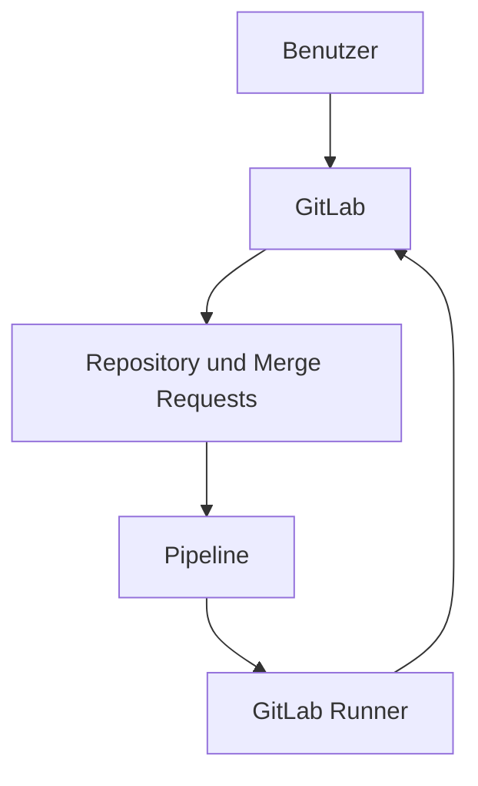

# GitLab

[Alle Dienste](../dienste.md) · [Schnellstart](../../SCHNELLSTART.md)

## Was macht der Dienst?

GitLab verwaltet Git-Repositories, Issues und Merge Requests.
Der mitgelieferte Runner kann CI-Jobs ausführen.
Das ist die eigene GitLab-Instanz auf dem Server, nicht dieses GitHub-Repository.
Die Benutzeranmeldung ist mit Authentik über OIDC verbunden.
Repository-Berechtigungen und Projektrollen werden weiterhin in GitLab vergeben.

## Einordnung in diesem Repository

| Punkt | Konfiguration |
|---|---|
| Stack-ID | `gitlab` |
| Browseradresse | `https://gitlab.<DOMAIN>` |
| Direkte Abhängigkeiten | [core](core.md) |
| Anmeldung | Forward Auth und OIDC |
| Deklarierte Dienstgruppen | `gitlab-admins`, `gitlab-users` |

`<DOMAIN>` steht für die bei der Einrichtung gewählte Basisdomain.
Abhängigkeiten werden vom Manager ergänzt; weitere indirekte Stacks können dazukommen.
Eine Dienstgruppe regelt den äußeren Zugang, nicht automatisch jede Berechtigung innerhalb der Anwendung.

## Bestandteile

| Compose-Service | Container-Image |
|---|---|
| `gitlab` | `gitlab/gitlab-ce:${GITLAB_VERSION}` |
| `gitlab-runner` | `gitlab/gitlab-runner:${GITLAB_RUNNER_VERSION}` |

Image-Variablen werden aus der Stack-Konfiguration aufgelöst.
Die Tabelle beschreibt den Repository-Stand, keine Liste bereits gestarteter Container.

## Zusammenspiel



Das Diagramm zeigt die wesentlichen Beziehungen, nicht jede Netzwerkverbindung.

## Einrichten und starten

Den [Schnellstart](../../SCHNELLSTART.md) einmal für den Host durchführen.
Danach im Manager **Ersteinrichtung** beziehungsweise **Stack-Auswahl ändern** öffnen:

```bash
sudo .venv/bin/python compose/manage.py
```

`gitlab` auswählen und die ermittelten Abhängigkeiten kontrollieren.
Vorhandene Werte werden wiederverwendet; neue Secrets gehören nicht in Git.
Erst nach erfolgreicher Einrichtung mit der Nutzung beginnen.

## Erste Nutzung

1. Über `gitlab.<DOMAIN>` mit einem berechtigten Authentik-Benutzer anmelden.
2. Beim ersten OIDC-Login das Anwendungskonto anlegen lassen.
3. Ein Projekt erstellen, eine README hinzufügen und einen ersten Commit speichern.
4. Für Teamarbeit Branches und Merge Requests verwenden.
5. Den mitgelieferten Runner separat in GitLab registrieren, bevor CI-Jobs eingeplant werden.

## Wichtige Einstellungen

| Einstellung | Bedeutung |
|---|---|
| `GITLAB_VERSION` | GitLab-Image-Version. |
| `GITLAB_RUNNER_VERSION` | Runner-Image-Version; Registrierung separat durchführen. |
| `GITLAB_OIDC_CLIENT_ID` | OIDC-Clientkennung. |
| `GITLAB_WEB_IDE_MARKETPLACE_FALLBACK` | Gespeicherte Auswahl `true` oder `false`; Standard aus. |

Die vollständigen Eingaben stehen in [`.env.example`](../../compose/gitlab/.env.example).
Normale Werte im Manager über **Konfiguration bearbeiten** ändern.
Passwortwechsel sind keine bloßen Textänderungen: Datei und laufender Dienst müssen zusammenpassen.

## Besonderheiten dieser Konfiguration

- Der Stack fragt bei der Einrichtung: „Web-IDE-Marketplace-Fallback erlauben?“; Enter bedeutet Nein.
- Die Auswahl wird in `GITLAB_WEB_IDE_MARKETPLACE_FALLBACK` gespeichert und nicht bei jedem Setup erneut gefragt.
- `false` deaktiviert den Single-Origin-Fallback; `true` erlaubt ihn. Das ist nicht der allgemeine Ein-/Ausschalter für alle Erweiterungen.
- `stack.py` setzt die Auswahl direkt mit `gitlab-rails runner` und kontrolliert die gespeicherten Werte.
- Die freie Selbstregistrierung bleibt unabhängig von dieser Auswahl deaktiviert.
- Zum Ändern den Manager-ENV-Editor verwenden: `true` oder `false` setzen; die anschließende Einrichtung wendet es an.
- Ein bloßer Start oder Neustart führt `after_start` nicht erneut aus.
- Unterstützt eine GitLab-Version das gewählte Application Setting nicht, bricht der Hook ab; es wird kein Erfolg vorgetäuscht.
- Nutzeränderungen erfolgen ausschließlich im Manager; deshalb gibt es absichtlich keinen periodischen Synchronisationscontainer.
- Vorhandene OIDC-Konten werden aktualisiert beziehungsweise gesperrt; Projekte und Beiträge werden nicht beim Nutzerlöschen entfernt.
- Der Runner ist noch nicht allein durch seinen Containerstart registriert und hat Zugriff auf den Docker-Socket.

## Daten und Sicherung

| Volume-Schlüssel | Tatsächlicher Volume-Name |
|---|---|
| `gitlab_config` | `managed_gitlab_config` |
| `gitlab_logs` | `managed_gitlab_logs` |
| `gitlab_data` | `managed_gitlab_data` |
| `gitlab_runner_config` | `managed_gitlab_runner_config` |

- GitLab-Konfiguration und GitLab-Daten sowie die Runner-Konfiguration berücksichtigen.
- Logs sind für Diagnose hilfreich, ersetzen aber keine Repository- und Datenbanksicherung.
- Nach einem Restore Nutzerberechtigungen und die gewählten Application Settings kontrollieren.

Im Manager **Backups / Import / Export** öffnen und Stack, Service und Mounts auswählen.
Alle benötigten Services berücksichtigen; eine einzelne Service-Auswahl ist kein vollständiges Stack-Backup.
Der Manager hält betroffene Schreiber für Mount-Sicherungen an.
Konfiguration kann zusätzlich mit `age` verschlüsselt gesichert werden.
Vor einer Wiederherstellung Ziel-Mounts und vorhandene Daten prüfen.

## Wenn etwas nicht funktioniert

| Beobachtung | Zuerst prüfen |
|---|---|
| GitLab startet lange | Die Erstinitialisierung abwarten; der Stack erlaubt bis zu 1500 Sekunden Bereitschaftszeit. |
| Nutzer sieht GitLab, aber kein Projekt | GitLab-Projektmitgliedschaften zusätzlich zur Authentik-Gruppe prüfen. |
| CI-Job bleibt wartend | Runner-Registrierung, Tags und Runner-Verfügbarkeit prüfen. |
| Setting-Hook schlägt fehl | Image-Version und GitLab-Fehlermeldung prüfen; die Einrichtung bleibt unvollständig. |

Für den Containerstatus und begrenzte Logs im Repository:

```bash
docker compose --project-directory compose/gitlab --env-file compose/gitlab/.env -p gitlab -f compose/gitlab/compose.yml ps
docker compose --project-directory compose/gitlab --env-file compose/gitlab/.env -p gitlab -f compose/gitlab/compose.yml logs --tail=80
```

Fehlt die `.env`, zuerst die Einrichtung abschließen.
Vor dem Weitergeben von Logs mögliche Zugangsdaten und persönliche Daten entfernen.

## Grenzen und weiterführende Dateien

Diese Seite beschreibt die vorhandene Konfiguration und ersetzt keinen Live-Test.
Ein erfolgreicher Compose-Check beweist weder SSO noch die vollständige Wiederherstellung.

- [Compose-Konfiguration](../../compose/gitlab/compose.yml)
- [Stack-Metadaten und Hooks](../../compose/gitlab/stack.py)
- [Gemeinsame Manager-Funktionen](../manager.md)
- [Ausstehende Betriebsprüfungen](../validierung.md)
