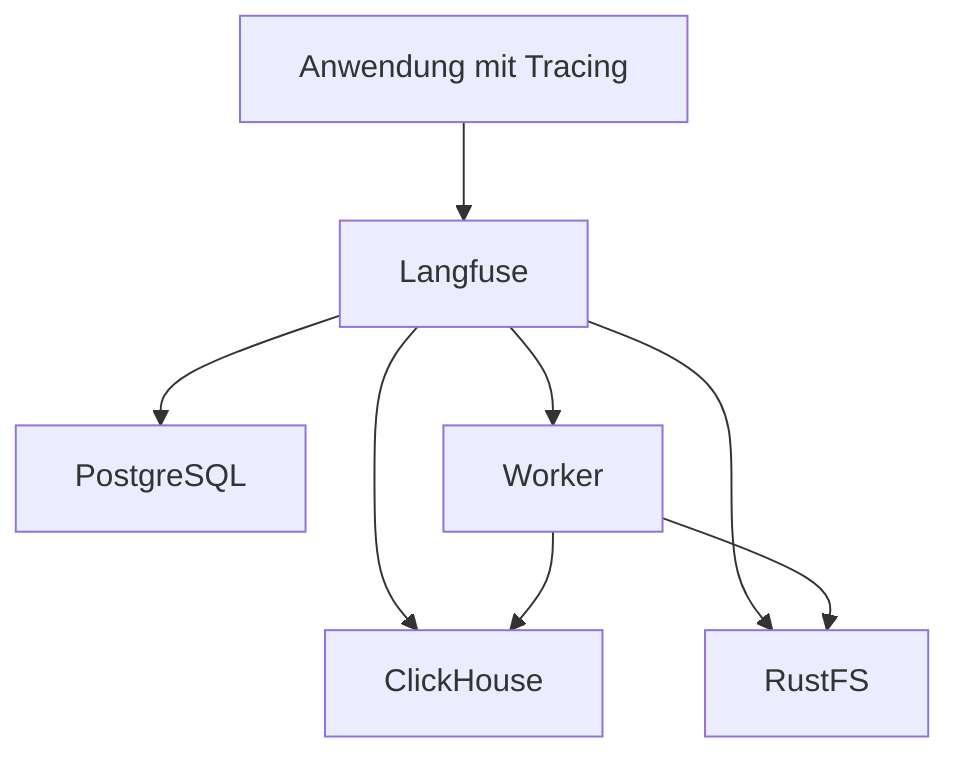

# Langfuse

[Alle Dienste](../dienste.md) · [Schnellstart](../../SCHNELLSTART.md)

## Was macht der Dienst?

Langfuse hilft beim Beobachten und Auswerten von LLM-Anwendungen.
Es sammelt Traces und zugehörige Informationen zu Modellaufrufen.
Damit lassen sich Abläufe, Laufzeiten und Fehler einzelner Anwendungen nachvollziehen.
Dieser Stack enthält Webanwendung, Worker, PostgreSQL, ClickHouse und Valkey.
RustFS stellt den benötigten Objektspeicher bereit.

## Einordnung in diesem Repository

| Punkt | Konfiguration |
|---|---|
| Stack-ID | `langfuse` |
| Browseradresse | `https://langfuse.<DOMAIN>` |
| Direkte Abhängigkeiten | [core](core.md), [rustfs](rustfs.md) |
| Anmeldung | Forward Auth und OIDC |
| Deklarierte Dienstgruppen | `langfuse-admins`, `langfuse-users` |

`<DOMAIN>` steht für die bei der Einrichtung gewählte Basisdomain.
Abhängigkeiten werden vom Manager ergänzt; weitere indirekte Stacks können dazukommen.
Eine Dienstgruppe regelt den äußeren Zugang, nicht automatisch jede Berechtigung innerhalb der Anwendung.

## Bestandteile

| Compose-Service | Container-Image |
|---|---|
| `langfuse-postgresql` | `postgres:${POSTGRES_VERSION}` |
| `langfuse-clickhouse` | `clickhouse/clickhouse-server:${CLICKHOUSE_VERSION}` |
| `langfuse-valkey` | `valkey/valkey:${VALKEY_VERSION}` |
| `langfuse-worker` | `langfuse/langfuse-worker:${LANGFUSE_VERSION}` |
| `langfuse` | `langfuse/langfuse:${LANGFUSE_VERSION}` |

Image-Variablen werden aus der Stack-Konfiguration aufgelöst.
Die Tabelle beschreibt den Repository-Stand, keine Liste bereits gestarteter Container.

## Zusammenspiel



Das Diagramm zeigt die wesentlichen Beziehungen, nicht jede Netzwerkverbindung.

## Einrichten und starten

Den [Schnellstart](../../SCHNELLSTART.md) einmal für den Host durchführen.
Danach im Manager **Ersteinrichtung** beziehungsweise **Stack-Auswahl ändern** öffnen:

```bash
sudo .venv/bin/python compose/manage.py
```

`langfuse` auswählen und die ermittelten Abhängigkeiten kontrollieren.
Vorhandene Werte werden wiederverwendet; neue Secrets gehören nicht in Git.
Erst nach erfolgreicher Einrichtung mit der Nutzung beginnen.

## Erste Nutzung

1. Mit einem berechtigten Benutzer über Authentik anmelden.
2. Ein Projekt für die zu beobachtende Anwendung anlegen.
3. Projektbezogene API-Schlüssel in der jeweiligen Integration hinterlegen.
4. Einen einzelnen Testaufruf auslösen und dessen Trace in Langfuse suchen.
5. Erst nach erfolgreicher Zuordnung weitere Workflows und Modelle anbinden.

## Wichtige Einstellungen

| Einstellung | Bedeutung |
|---|---|
| `LANGFUSE_VERSION` | Gemeinsame Version von Webanwendung und Worker. |
| `LANGFUSE_OIDC_CLIENT_ID` | Clientkennung für Authentik. |
| `LANGFUSE_OIDC_CLIENT_SECRET` | Client-Secret für die Anmeldung. |
| `DOMAIN` | Öffentliche Langfuse-Adresse. |

Die vollständigen Eingaben stehen in [`.env.example`](../../compose/langfuse/.env.example).
Normale Werte im Manager über **Konfiguration bearbeiten** ändern.
Passwortwechsel sind keine bloßen Textänderungen: Datei und laufender Dienst müssen zusammenpassen.

## Besonderheiten dieser Konfiguration

- OIDC ist in `stack.py` deklariert; das ersetzt keine Langfuse-Projektberechtigungen.
- RustFS wird als Abhängigkeit gestartet und stellt den Bucket für die Integration bereit.
- LiteLLM enthält bereits den Callback `langfuse_otel`; passende Projekt-Credentials bleiben erforderlich.
- Worker und Weboberfläche verwenden gemeinsame Hintergrunddienste; nur die Weboberfläche zu sichern reicht nicht.
- Die tatsächlichen Trace-Inhalte hängen von der sendenden Anwendung und deren Logging-Konfiguration ab.
- Ein gestarteter Langfuse-Stack sammelt nicht automatisch jeden Modellaufruf im gesamten Netz.

## Daten und Sicherung

| Volume-Schlüssel | Tatsächlicher Volume-Name |
|---|---|
| `langfuse_postgresql_data` | `managed_langfuse_postgresql_data` |
| `langfuse_clickhouse_data` | `managed_langfuse_clickhouse_data` |
| `langfuse_clickhouse_logs` | `managed_langfuse_clickhouse_logs` |
| `langfuse_valkey_data` | `managed_langfuse_valkey_data` |

- PostgreSQL, ClickHouse und zugehörige Objekte in RustFS zusammen berücksichtigen.
- Ein Backup ausschließlich des Webcontainers enthält diese Daten nicht vollständig.
- Bei konsistenten Gesamtsicherungen auch Schreibzugriffe des Workers einbeziehen.

Im Manager **Backups / Import / Export** öffnen und Stack, Service und Mounts auswählen.
Alle benötigten Services berücksichtigen; eine einzelne Service-Auswahl ist kein vollständiges Stack-Backup.
Der Manager hält betroffene Schreiber für Mount-Sicherungen an.
Konfiguration kann zusätzlich mit `age` verschlüsselt gesichert werden.
Vor einer Wiederherstellung Ziel-Mounts und vorhandene Daten prüfen.

## Wenn etwas nicht funktioniert

| Beobachtung | Zuerst prüfen |
|---|---|
| Keine Traces sichtbar | Projekt, API-Schlüssel, Callback-Konfiguration und Senderlogs prüfen. |
| Weboberfläche läuft, Verarbeitung stockt | Worker, Valkey, ClickHouse und RustFS prüfen. |
| S3-Zugriff scheitert | Bucket, internen Endpoint und den vorgesehenen Dienstbenutzer prüfen. |
| SSO funktioniert, Projekt fehlt | Projektmitgliedschaft in Langfuse kontrollieren. |

Für den Containerstatus und begrenzte Logs im Repository:

```bash
docker compose --project-directory compose/langfuse --env-file compose/langfuse/.env -p langfuse -f compose/langfuse/compose.yml ps
docker compose --project-directory compose/langfuse --env-file compose/langfuse/.env -p langfuse -f compose/langfuse/compose.yml logs --tail=80
```

Fehlt die `.env`, zuerst die Einrichtung abschließen.
Vor dem Weitergeben von Logs mögliche Zugangsdaten und persönliche Daten entfernen.

## Grenzen und weiterführende Dateien

Diese Seite beschreibt die vorhandene Konfiguration und ersetzt keinen Live-Test.
Ein erfolgreicher Compose-Check beweist weder SSO noch die vollständige Wiederherstellung.

- [Compose-Konfiguration](../../compose/langfuse/compose.yml)
- [Stack-Metadaten und Hooks](../../compose/langfuse/stack.py)
- [Gemeinsame Manager-Funktionen](../manager.md)
- [Ausstehende Betriebsprüfungen](../validierung.md)
