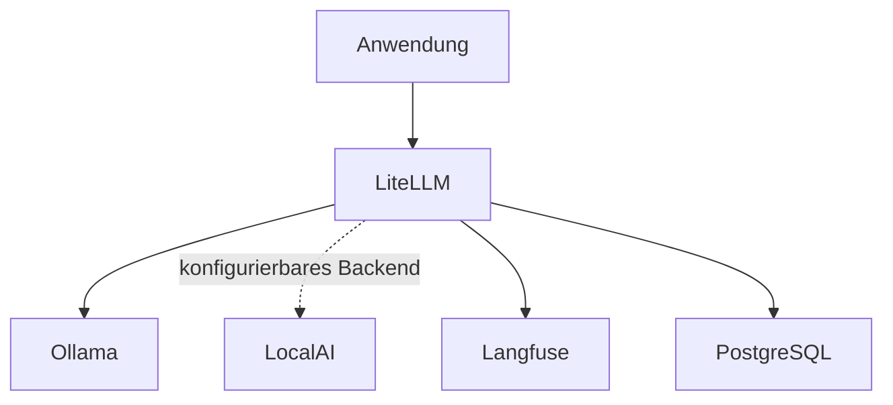

# LiteLLM

[Alle Dienste](../dienste.md) · [Schnellstart](../../SCHNELLSTART.md)

## Was macht der Dienst?

LiteLLM ist das gemeinsame API-Gateway für Modellzugriffe.
Anwendungen können damit einen zentralen Endpoint statt vieler einzelner Backends nutzen.
Dieses Repository bindet zunächst ein Ollama-Modell über eine Konfigurationsdatei ein.
LocalAI und Langfuse sind ebenfalls als Stack-Abhängigkeiten vorgesehen.
Modelle installieren und Modellaufrufe vermitteln sind unterschiedliche Aufgaben.

## Einordnung in diesem Repository

| Punkt | Konfiguration |
|---|---|
| Stack-ID | `litellm` |
| Browseradresse | `https://litellm.<DOMAIN>` |
| Direkte Abhängigkeiten | [core](core.md), [langfuse](langfuse.md), [ollama](ollama.md), [localai](localai.md) |
| Anmeldung | Forward Auth und OIDC |
| Deklarierte Dienstgruppen | `litellm-admins`, `litellm-users` |

`<DOMAIN>` steht für die bei der Einrichtung gewählte Basisdomain.
Abhängigkeiten werden vom Manager ergänzt; weitere indirekte Stacks können dazukommen.
Eine Dienstgruppe regelt den äußeren Zugang, nicht automatisch jede Berechtigung innerhalb der Anwendung.

## Bestandteile

| Compose-Service | Container-Image |
|---|---|
| `litellm-postgresql` | `postgres:${POSTGRES_VERSION}` |
| `litellm` | `ghcr.io/berriai/litellm:${LITELLM_VERSION}` |

Image-Variablen werden aus der Stack-Konfiguration aufgelöst.
Die Tabelle beschreibt den Repository-Stand, keine Liste bereits gestarteter Container.

## Zusammenspiel



Das Diagramm zeigt die wesentlichen Beziehungen, nicht jede Netzwerkverbindung.

## Einrichten und starten

Den [Schnellstart](../../SCHNELLSTART.md) einmal für den Host durchführen.
Danach im Manager **Ersteinrichtung** beziehungsweise **Stack-Auswahl ändern** öffnen:

```bash
sudo .venv/bin/python compose/manage.py
```

`litellm` auswählen und die ermittelten Abhängigkeiten kontrollieren.
Vorhandene Werte werden wiederverwendet; neue Secrets gehören nicht in Git.
Erst nach erfolgreicher Einrichtung mit der Nutzung beginnen.

## Erste Nutzung

1. Prüfen, ob das gewünschte Modell im tatsächlichen Backend installiert ist.
2. In `compose/litellm/config.yaml` den Modellnamen und Backend-Zugang kontrollieren.
3. Die Verwaltungsoberfläche öffnen und für einen Client einen passenden Schlüssel bereitstellen.
4. Aus einem angebundenen Container den internen Gateway-Endpoint verwenden.
5. Mit einem kleinen Modellaufruf prüfen, ob Modellname, Credentials und Antwort zusammenpassen.

## Wichtige Einstellungen

| Einstellung | Bedeutung |
|---|---|
| `LITELLM_VERSION` | Version des Gateway-Images. |
| `LITELLM_MASTER_KEY` | Vertraulicher Verwaltungsschlüssel. |
| `LITELLM_OIDC_CLIENT_ID` | Clientkennung, soweit in der Vorlage vorgesehen. |
| `DOMAIN` | Domain für API und Verwaltungsoberfläche. |

Die vollständigen Eingaben stehen in [`.env.example`](../../compose/litellm/.env.example).
Normale Werte im Manager über **Konfiguration bearbeiten** ändern.
Passwortwechsel sind keine bloßen Textänderungen: Datei und laufender Dienst müssen zusammenpassen.

## Besonderheiten dieser Konfiguration

- Die mitgelieferte Konfiguration nennt `qwen3:0.6b` und routet nach `http://ollama:11434`.
- Der Start von Ollama lädt dieses Modell nicht automatisch herunter.
- LocalAI wird mit gestartet, aber erst ein passender Modelleinsatz beziehungsweise eine Modellkonfiguration nutzt dieses Backend.
- Das Gateway verwaltet API-Zugriffe; Modelldateien bleiben Sache von Ollama oder LocalAI.
- `/v1` und Verwaltungsoberfläche liegen hinter Forward Auth; ein API-Key allein überwindet diese äußere Anmeldung nicht.
- Interne Clients verwenden den internen Dienstzugang mit LiteLLM-Schlüssel, sofern sie im passenden Netz sind.
- Die Konfiguration schaltet Telemetrie und Message-Logging im angegebenen Umfang ab und enthält den Langfuse-Callback.

## Daten und Sicherung

| Volume-Schlüssel | Tatsächlicher Volume-Name |
|---|---|
| `litellm_postgresql_data` | `managed_litellm_postgresql_data` |

- Die LiteLLM-Datenbank sowie Konfigurationsdatei und vertrauliche ENV-Werte berücksichtigen.
- Modelle selbst werden nicht im LiteLLM-Datenbankvolume gespeichert.
- Bei Schlüsselverlust können Clients ausfallen; Wiederherstellung mit einem Testclient prüfen.

Im Manager **Backups / Import / Export** öffnen und Stack, Service und Mounts auswählen.
Alle benötigten Services berücksichtigen; eine einzelne Service-Auswahl ist kein vollständiges Stack-Backup.
Der Manager hält betroffene Schreiber für Mount-Sicherungen an.
Konfiguration kann zusätzlich mit `age` verschlüsselt gesichert werden.
Vor einer Wiederherstellung Ziel-Mounts und vorhandene Daten prüfen.

## Wenn etwas nicht funktioniert

| Beobachtung | Zuerst prüfen |
|---|---|
| Modell nicht gefunden | Freigegebenen LiteLLM-Modellnamen und tatsächliche Backend-Installation abgleichen. |
| 401 vom Gateway | Den LiteLLM-Schlüssel und seine Berechtigungen prüfen. |
| 302 oder Login-HTML am öffentlichen API-Pfad | Forward Auth verlangt zusätzlich die äußere Anmeldung. |
| Keine Langfuse-Daten | Projekt-Credentials und Callback-Anbindung kontrollieren. |

Für den Containerstatus und begrenzte Logs im Repository:

```bash
docker compose --project-directory compose/litellm --env-file compose/litellm/.env -p litellm -f compose/litellm/compose.yml ps
docker compose --project-directory compose/litellm --env-file compose/litellm/.env -p litellm -f compose/litellm/compose.yml logs --tail=80
```

Fehlt die `.env`, zuerst die Einrichtung abschließen.
Vor dem Weitergeben von Logs mögliche Zugangsdaten und persönliche Daten entfernen.

## Grenzen und weiterführende Dateien

Diese Seite beschreibt die vorhandene Konfiguration und ersetzt keinen Live-Test.
Ein erfolgreicher Compose-Check beweist weder SSO noch die vollständige Wiederherstellung.

- [Compose-Konfiguration](../../compose/litellm/compose.yml)
- [Stack-Metadaten und Hooks](../../compose/litellm/stack.py)
- [Gemeinsame Manager-Funktionen](../manager.md)
- [Ausstehende Betriebsprüfungen](../validierung.md)
