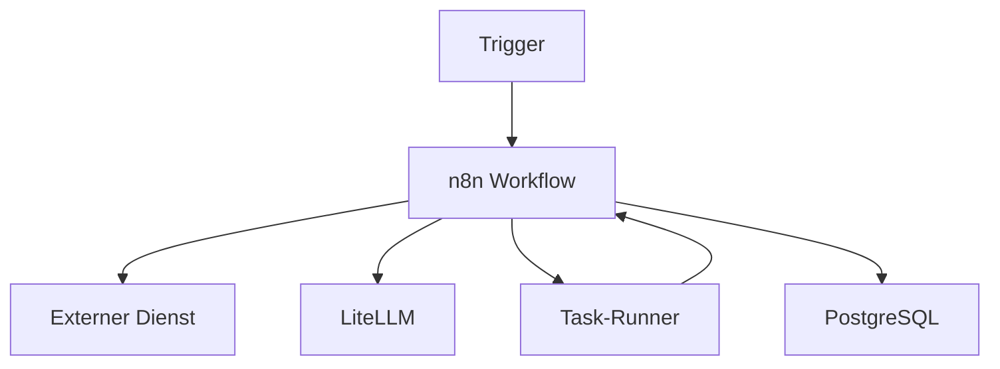

# n8n

[Alle Dienste](../dienste.md) · [Schnellstart](../../SCHNELLSTART.md)

## Was macht der Dienst?

n8n verbindet Dienste zu automatisierten Workflows.
Ein Workflow kann etwa eine Eingabe annehmen, Daten abrufen und eine Aktion ausführen.
Der Stack enthält die Anwendung, PostgreSQL und einen separaten Task-Runner.
LiteLLM, Qdrant, Neo4j und SearXNG stehen als Abhängigkeiten bereit.
Die eigentlichen Workflows und Credentials werden in n8n eingerichtet.

## Einordnung in diesem Repository

| Punkt | Konfiguration |
|---|---|
| Stack-ID | `n8n` |
| Browseradresse | `https://n8n.<DOMAIN>` |
| Direkte Abhängigkeiten | [core](core.md), [litellm](litellm.md), [qdrant](qdrant.md), [neo4j](neo4j.md), [searxng](searxng.md) |
| Anmeldung | Forward Auth; kein nativer SSO-Adapter in diesem Stack. |
| Deklarierte Dienstgruppen | `n8n-admins`, `n8n-users` |

`<DOMAIN>` steht für die bei der Einrichtung gewählte Basisdomain.
Abhängigkeiten werden vom Manager ergänzt; weitere indirekte Stacks können dazukommen.
Eine Dienstgruppe regelt den äußeren Zugang, nicht automatisch jede Berechtigung innerhalb der Anwendung.

## Bestandteile

| Compose-Service | Container-Image |
|---|---|
| `n8n-postgresql` | `postgres:${POSTGRES_VERSION}` |
| `n8n` | `n8nio/n8n:${N8N_VERSION}` |
| `n8n-runners` | `n8nio/runners:${N8N_VERSION}` |

Image-Variablen werden aus der Stack-Konfiguration aufgelöst.
Die Tabelle beschreibt den Repository-Stand, keine Liste bereits gestarteter Container.

## Zusammenspiel



Das Diagramm zeigt die wesentlichen Beziehungen, nicht jede Netzwerkverbindung.

## Einrichten und starten

Den [Schnellstart](../../SCHNELLSTART.md) einmal für den Host durchführen.
Danach im Manager **Ersteinrichtung** beziehungsweise **Stack-Auswahl ändern** öffnen:

```bash
sudo .venv/bin/python compose/manage.py
```

`n8n` auswählen und die ermittelten Abhängigkeiten kontrollieren.
Vorhandene Werte werden wiederverwendet; neue Secrets gehören nicht in Git.
Erst nach erfolgreicher Einrichtung mit der Nutzung beginnen.

## Erste Nutzung

1. Die Oberfläche öffnen und die notwendige lokale Anwendungseinrichtung abschließen.
2. Einen Workflow zunächst mit manuellem Trigger anlegen.
3. Eine ungefährliche Testabfrage ausführen und ihre Ausgabe ansehen.
4. Dienst-Credentials hinterlegen und erst dann weitere Nodes verbinden.
5. Zeitplan oder Webhook erst aktivieren, wenn der manuelle Ablauf korrekt funktioniert.

## Wichtige Einstellungen

| Einstellung | Bedeutung |
|---|---|
| `N8N_VERSION` | Version der Workflow-Anwendung. |
| `N8N_RUNNERS_AUTH_TOKEN` | Vertraulicher Verbindungstoken für den Task-Runner. |
| `N8N_ENCRYPTION_KEY` | Vertraulicher Schlüssel für gespeicherte Credentials. |
| `DOMAIN` | Öffentliche n8n- und Webhook-Adresse. |

Die vollständigen Eingaben stehen in [`.env.example`](../../compose/n8n/.env.example).
Normale Werte im Manager über **Konfiguration bearbeiten** ändern.
Passwortwechsel sind keine bloßen Textänderungen: Datei und laufender Dienst müssen zusammenpassen.

## Besonderheiten dieser Konfiguration

- Dieser Stack hat keinen nativen SSO-Eintrag in `stack.py`; Forward Auth ersetzt das n8n-Konto nicht.
- Abhängigkeiten erzeugen keine fertigen n8n-Credentials oder Beispielworkflows.
- Das persistente Verschlüsselungsgeheimnis wird zum Lesen gespeicherter Credentials benötigt.
- Der separate Runner ist für ausgelagerte Aufgaben vorgesehen; seine Verbindung zur Hauptanwendung prüfen.
- Öffentliche Webhooks liegen ebenfalls hinter Forward Auth. Externe Sender können daran scheitern.
- Ein interner Aufruf aus einem angebundenen Container kann einen passenden internen Endpoint nutzen.

## Daten und Sicherung

| Volume-Schlüssel | Tatsächlicher Volume-Name |
|---|---|
| `n8n_postgresql_data` | `managed_n8n_postgresql_data` |
| `n8n_data` | `managed_n8n_data` |

- PostgreSQL-Daten, n8n-Dateidaten und die zugehörigen Schlüssel sichern.
- Ein Workflow-Export allein ist kein vollständiges Backup aller Credentials und Ausführungsdaten.
- Vor Wiederanlauf kontrollieren, welche aktiven Workflows externe Änderungen auslösen können.

Im Manager **Backups / Import / Export** öffnen und Stack, Service und Mounts auswählen.
Alle benötigten Services berücksichtigen; eine einzelne Service-Auswahl ist kein vollständiges Stack-Backup.
Der Manager hält betroffene Schreiber für Mount-Sicherungen an.
Konfiguration kann zusätzlich mit `age` verschlüsselt gesichert werden.
Vor einer Wiederherstellung Ziel-Mounts und vorhandene Daten prüfen.

## Wenn etwas nicht funktioniert

| Beobachtung | Zuerst prüfen |
|---|---|
| Workflow läuft manuell, aber nicht automatisch | Aktivierung, Trigger und Zeitplan kontrollieren. |
| Credentials nach Restore unlesbar | Prüfen, ob der ursprüngliche Verschlüsselungsschlüssel vorhanden ist. |
| Webhook liefert Loginseite | Vorgeschalteten Authentik-Zugriff berücksichtigen. |
| Code-Aufgabe startet nicht | Status und Logs des Runner-Dienstes prüfen. |

Für den Containerstatus und begrenzte Logs im Repository:

```bash
docker compose --project-directory compose/n8n --env-file compose/n8n/.env -p n8n -f compose/n8n/compose.yml ps
docker compose --project-directory compose/n8n --env-file compose/n8n/.env -p n8n -f compose/n8n/compose.yml logs --tail=80
```

Fehlt die `.env`, zuerst die Einrichtung abschließen.
Vor dem Weitergeben von Logs mögliche Zugangsdaten und persönliche Daten entfernen.

## Grenzen und weiterführende Dateien

Diese Seite beschreibt die vorhandene Konfiguration und ersetzt keinen Live-Test.
Ein erfolgreicher Compose-Check beweist weder SSO noch die vollständige Wiederherstellung.

- [Compose-Konfiguration](../../compose/n8n/compose.yml)
- [Stack-Metadaten und Hooks](../../compose/n8n/stack.py)
- [Gemeinsame Manager-Funktionen](../manager.md)
- [Ausstehende Betriebsprüfungen](../validierung.md)
