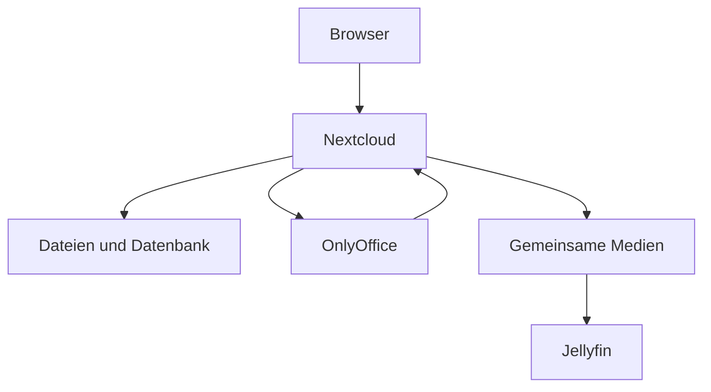

# Nextcloud und OnlyOffice

[Alle Dienste](../dienste.md) · [Schnellstart](../../SCHNELLSTART.md)

## Was macht der Dienst?

Nextcloud stellt Dateien, Freigaben und weitere Cloud-Funktionen im Browser bereit.
OnlyOffice ist in diesem Stack als Dienst für die Bearbeitung von Office-Dokumenten enthalten.
PostgreSQL, Redis und ein Cron-Dienst unterstützen den Betrieb.
Ein gemeinsames Medienvolume kann Dateien für Jellyfin bereitstellen.
Die Anmeldung in Nextcloud wird über Authentik-OIDC eingerichtet.

## Einordnung in diesem Repository

| Punkt | Konfiguration |
|---|---|
| Stack-ID | `nextcloud` |
| Browseradresse | `https://cloud.<DOMAIN>`, `https://office.<DOMAIN>` |
| Direkte Abhängigkeiten | [core](core.md) |
| Anmeldung | Forward Auth und OIDC |
| Deklarierte Dienstgruppen | `nextcloud-admins`, `nextcloud-users` |

`<DOMAIN>` steht für die bei der Einrichtung gewählte Basisdomain.
Abhängigkeiten werden vom Manager ergänzt; weitere indirekte Stacks können dazukommen.
Eine Dienstgruppe regelt den äußeren Zugang, nicht automatisch jede Berechtigung innerhalb der Anwendung.

## Bestandteile

| Compose-Service | Container-Image |
|---|---|
| `nextcloud` | `nextcloud:${NEXTCLOUD_VERSION}` |
| `nextcloud-cron` | `nextcloud:${NEXTCLOUD_VERSION}` |
| `nextcloud-postgresql` | `postgres:${POSTGRES_VERSION}` |
| `nextcloud-redis` | `redis:${REDIS_VERSION}` |
| `jellyfin-media-permissions` | `alpine:${ALPINE_VERSION}` |
| `onlyoffice` | `onlyoffice/documentserver:${ONLYOFFICE_VERSION}` |

Image-Variablen werden aus der Stack-Konfiguration aufgelöst.
Die Tabelle beschreibt den Repository-Stand, keine Liste bereits gestarteter Container.

## Zusammenspiel



Das Diagramm zeigt die wesentlichen Beziehungen, nicht jede Netzwerkverbindung.

## Einrichten und starten

Den [Schnellstart](../../SCHNELLSTART.md) einmal für den Host durchführen.
Danach im Manager **Ersteinrichtung** beziehungsweise **Stack-Auswahl ändern** öffnen:

```bash
sudo .venv/bin/python compose/manage.py
```

`nextcloud` auswählen und die ermittelten Abhängigkeiten kontrollieren.
Vorhandene Werte werden wiederverwendet; neue Secrets gehören nicht in Git.
Erst nach erfolgreicher Einrichtung mit der Nutzung beginnen.

## Erste Nutzung

1. Mit einem berechtigten Benutzer `cloud.<DOMAIN>` öffnen und den OIDC-Login testen.
2. Eine kleine Datei hochladen, wieder herunterladen und ihren Inhalt vergleichen.
3. Eine Testfreigabe anlegen und deren tatsächlichen Zugriff prüfen.
4. Für Office-Bearbeitung den OnlyOffice-Connector und die passenden internen beziehungsweise externen Adressen prüfen.
5. Erst nach funktionierendem Browserbetrieb weitere Sync- oder Mobilclients anbinden.

## Wichtige Einstellungen

| Einstellung | Bedeutung |
|---|---|
| `NEXTCLOUD_VERSION` | Version der Cloud-Anwendung. |
| `ONLYOFFICE_VERSION` | Version des Dokumentendienstes. |
| `PHP_MEMORY_LIMIT` | PHP-Speichergrenze für Nextcloud. |
| `PHP_UPLOAD_LIMIT` | Uploadgrenze; weitere Proxy- und Clientgrenzen können zusätzlich wirken. |

Die vollständigen Eingaben stehen in [`.env.example`](../../compose/nextcloud/.env.example).
Normale Werte im Manager über **Konfiguration bearbeiten** ändern.
Passwortwechsel sind keine bloßen Textänderungen: Datei und laufender Dienst müssen zusammenpassen.

## Besonderheiten dieser Konfiguration

- Der Einrichtungshook installiert beziehungsweise aktiviert `user_oidc` und richtet den Provider ein.
- Vorhandene SSO-Konten werden durch den Nutzerhook aktiviert, deaktiviert und gegebenenfalls der Admin-Gruppe zugeordnet.
- OnlyOffice verwendet ein eigenes JWT-Geheimnis; beide Seiten der Integration müssen dazu passen.
- Der Container allein konfiguriert nicht automatisch jede Nextcloud-App oder die vollständige Office-Integration.
- `cloud.<DOMAIN>` und `office.<DOMAIN>` sind unterschiedliche Routen.
- Freigabelinks, DAV-Clients und Office-Rückrufe müssen die zusätzliche äußere Authentifizierung berücksichtigen.
- Das externe Medienvolume heißt `managed_jellyfin_media`; der Vorbereitungsschritt richtet dessen Rechte ein.
- Der Cron-Dienst ist für Hintergrundarbeiten da; die Weboberfläche allein ist kein vollständiger Betriebsindikator.

## Daten und Sicherung

| Volume-Schlüssel | Tatsächlicher Volume-Name |
|---|---|
| `nextcloud_html` | `managed_nextcloud_html` |
| `nextcloud_postgresql_data` | `managed_nextcloud_postgresql_data` |
| `nextcloud_redis_data` | `managed_nextcloud_redis_data` |
| `onlyoffice_data` | `managed_nextcloud_onlyoffice_data` |
| `onlyoffice_logs` | `managed_nextcloud_onlyoffice_logs` |
| `onlyoffice_lib` | `managed_nextcloud_onlyoffice_lib` |
| `onlyoffice_postgresql_data` | `managed_nextcloud_onlyoffice_postgresql_data` |
| `onlyoffice_rabbitmq_data` | `managed_nextcloud_onlyoffice_rabbitmq_data` |
| `onlyoffice_redis_data` | `managed_nextcloud_onlyoffice_redis_data` |
| `onlyoffice_custom_fonts` | `managed_nextcloud_onlyoffice_custom_fonts` |
| `jellyfin_media` | `managed_jellyfin_media` |

- Nextcloud-Dateibestand und PostgreSQL-Datenbank gemeinsam sichern.
- OnlyOffice-Daten und gemeinsam verwendete Medien je nach Nutzung zusätzlich berücksichtigen.
- Eine Auswahl nur des Webdienstes erfasst nicht automatisch die Mounts aller anderen Services.

Im Manager **Backups / Import / Export** öffnen und Stack, Service und Mounts auswählen.
Alle benötigten Services berücksichtigen; eine einzelne Service-Auswahl ist kein vollständiges Stack-Backup.
Der Manager hält betroffene Schreiber für Mount-Sicherungen an.
Konfiguration kann zusätzlich mit `age` verschlüsselt gesichert werden.
Vor einer Wiederherstellung Ziel-Mounts und vorhandene Daten prüfen.

## Wenn etwas nicht funktioniert

| Beobachtung | Zuerst prüfen |
|---|---|
| OIDC-App oder Provider fehlt | Einrichtungshook und installierte Nextcloud-Version prüfen. |
| Office-Dokument öffnet nicht | Connector, JWT, Adressen und Forward Auth auf beiden Wegen prüfen. |
| Dateien erscheinen nicht beim Client | DAV-Zugang und zusätzliche Authentifizierung prüfen. |
| Hintergrundjobs bleiben liegen | Cron-Container und seine Logs ansehen. |

Für den Containerstatus und begrenzte Logs im Repository:

```bash
docker compose --project-directory compose/nextcloud --env-file compose/nextcloud/.env -p nextcloud -f compose/nextcloud/compose.yml ps
docker compose --project-directory compose/nextcloud --env-file compose/nextcloud/.env -p nextcloud -f compose/nextcloud/compose.yml logs --tail=80
```

Fehlt die `.env`, zuerst die Einrichtung abschließen.
Vor dem Weitergeben von Logs mögliche Zugangsdaten und persönliche Daten entfernen.

## Grenzen und weiterführende Dateien

Diese Seite beschreibt die vorhandene Konfiguration und ersetzt keinen Live-Test.
Ein erfolgreicher Compose-Check beweist weder SSO noch die vollständige Wiederherstellung.

- [Compose-Konfiguration](../../compose/nextcloud/compose.yml)
- [Stack-Metadaten und Hooks](../../compose/nextcloud/stack.py)
- [Gemeinsame Manager-Funktionen](../manager.md)
- [Ausstehende Betriebsprüfungen](../validierung.md)
