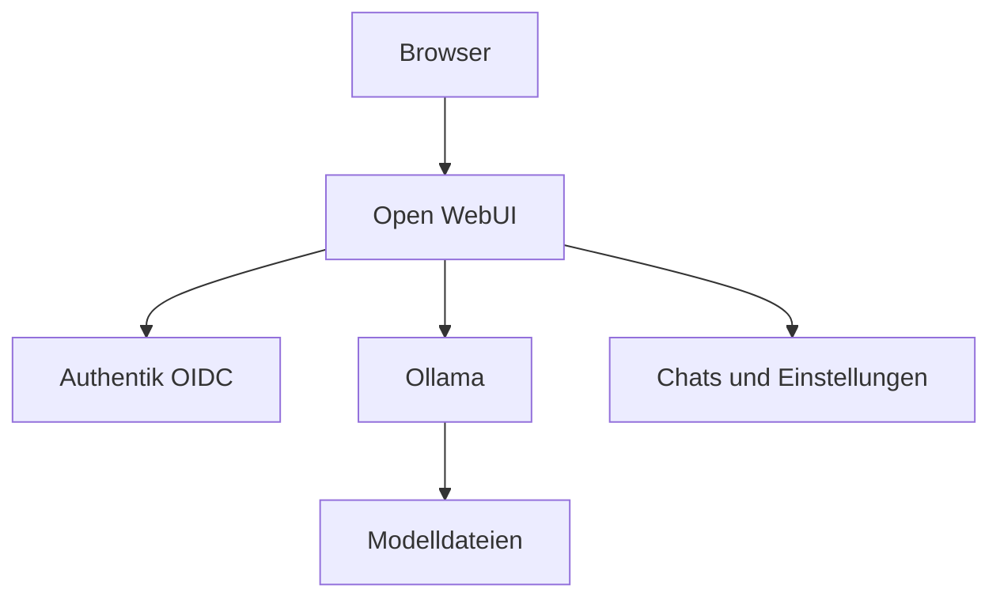

# Open WebUI

[Alle Dienste](../dienste.md) · [Schnellstart](../../SCHNELLSTART.md)

## Was macht der Dienst?

Open WebUI ist die Browseroberfläche für Gespräche mit Sprachmodellen.
Sie speichert unter anderem Unterhaltungen und Anwendungseinstellungen.
In dieser Compose-Konfiguration verwendet sie zunächst Ollama direkt.
LiteLLM wird als Abhängigkeit mit eingerichtet, ist aber nicht automatisch die aktive Modellverbindung.
Die Anmeldung erfolgt ausschließlich über Authentik-SSO.

## Einordnung in diesem Repository

| Punkt | Konfiguration |
|---|---|
| Stack-ID | `open-webui` |
| Browseradresse | `https://webui.<DOMAIN>` |
| Direkte Abhängigkeiten | [core](core.md), [litellm](litellm.md), [searxng](searxng.md) |
| Anmeldung | Forward Auth und OIDC |
| Deklarierte Dienstgruppen | `open-webui-admins`, `open-webui-users` |

`<DOMAIN>` steht für die bei der Einrichtung gewählte Basisdomain.
Abhängigkeiten werden vom Manager ergänzt; weitere indirekte Stacks können dazukommen.
Eine Dienstgruppe regelt den äußeren Zugang, nicht automatisch jede Berechtigung innerhalb der Anwendung.

## Bestandteile

| Compose-Service | Container-Image |
|---|---|
| `open-webui` | `ghcr.io/open-webui/open-webui:${OPEN_WEBUI_VERSION}` |

Image-Variablen werden aus der Stack-Konfiguration aufgelöst.
Die Tabelle beschreibt den Repository-Stand, keine Liste bereits gestarteter Container.

## Zusammenspiel



Das Diagramm zeigt die wesentlichen Beziehungen, nicht jede Netzwerkverbindung.

## Einrichten und starten

Den [Schnellstart](../../SCHNELLSTART.md) einmal für den Host durchführen.
Danach im Manager **Ersteinrichtung** beziehungsweise **Stack-Auswahl ändern** öffnen:

```bash
sudo .venv/bin/python compose/manage.py
```

`open-webui` auswählen und die ermittelten Abhängigkeiten kontrollieren.
Vorhandene Werte werden wiederverwendet; neue Secrets gehören nicht in Git.
Erst nach erfolgreicher Einrichtung mit der Nutzung beginnen.

## Erste Nutzung

1. Eine der Open-WebUI-Dienstgruppen über den Manager zuweisen.
2. `webui.<DOMAIN>` öffnen und der Weiterleitung zu Authentik folgen.
3. Ein bereits in Ollama installiertes Modell auswählen und einen kurzen Testchat starten.
4. Erst danach weitere Modelle oder optionale Werkzeuge hinzufügen.
5. Falls LiteLLM als Gateway genutzt werden soll, die OpenAI-kompatible Verbindung bewusst konfigurieren und testen.

## Wichtige Einstellungen

| Einstellung | Bedeutung |
|---|---|
| `OPEN_WEBUI_VERSION` | Version der Browseroberfläche. |
| `OPENWEBUI_OIDC_CLIENT_ID` | OIDC-Clientkennung. |
| `OPENWEBUI_OIDC_CLIENT_SECRET` | Vertrauliches Client-Secret in der ENV-Konfiguration. |
| `DOMAIN` | Basis für WebUI-URL und Callback. |

Die vollständigen Eingaben stehen in [`.env.example`](../../compose/open-webui/.env.example).
Normale Werte im Manager über **Konfiguration bearbeiten** ändern.
Passwortwechsel sind keine bloßen Textänderungen: Datei und laufender Dienst müssen zusammenpassen.

## Besonderheiten dieser Konfiguration

- Lokales Loginformular, Passwortanmeldung und lokale Selbstregistrierung sind in Compose abgeschaltet.
- OIDC-Anmeldung und SSO-Kontoanlage sind eingeschaltet; die automatische Weiterleitung führt zu Authentik.
- Es gibt keine unterstützte lokale Login-Alternative in diesem Stack; die alte Variante bleibt nur im Archiv.
- `ENABLE_OPENAI_API=false` bedeutet: die vorhandene LiteLLM-Abhängigkeit allein aktiviert noch keinen Gateway-Zugriff.
- Der konfigurierte Modellserver ist `http://ollama:11434` im Docker-Netz.
- SSO-Rollen werden aus den bereitgestellten Claims übernommen; Admin- und Nutzerzugriff getrennt testen.
- Die Einbindung einer Suchmaschine muss zusätzlich in der Anwendung passend eingestellt werden.
- Für Anmeldeprobleme zuerst Authentik reparieren; kein lokales Passwort-Overlay aus `_alt` verwenden.

## Daten und Sicherung

| Volume-Schlüssel | Tatsächlicher Volume-Name |
|---|---|
| `openwebui_data` | `managed_openwebui_data` |

- Das Datenvolume enthält Chats, Anwendungskonfiguration und Kontozuordnungen.
- Den WebUI-Secret-Key bei einer Wiederherstellung mit berücksichtigen.
- Modelldateien liegen bei Ollama beziehungsweise LocalAI und benötigen deren eigene Sicherung.

Im Manager **Backups / Import / Export** öffnen und Stack, Service und Mounts auswählen.
Alle benötigten Services berücksichtigen; eine einzelne Service-Auswahl ist kein vollständiges Stack-Backup.
Der Manager hält betroffene Schreiber für Mount-Sicherungen an.
Konfiguration kann zusätzlich mit `age` verschlüsselt gesichert werden.
Vor einer Wiederherstellung Ziel-Mounts und vorhandene Daten prüfen.

## Wenn etwas nicht funktioniert

| Beobachtung | Zuerst prüfen |
|---|---|
| Keine Modelle auswählbar | Prüfen, ob Ollama läuft und dort tatsächlich Modelle installiert sind. |
| Login-Schleife | Domain, OIDC-Client, Callback und Browser-Cookies prüfen. |
| Nach Login kein Zugriff | Zugewiesene Dienstgruppe und vom Provider gelieferte Rolle prüfen. |
| LiteLLM erscheint nicht | Die OpenAI-Verbindung ist in dieser Compose-Voreinstellung deaktiviert. |

Für den Containerstatus und begrenzte Logs im Repository:

```bash
docker compose --project-directory compose/open-webui --env-file compose/open-webui/.env -p open-webui -f compose/open-webui/compose.yml ps
docker compose --project-directory compose/open-webui --env-file compose/open-webui/.env -p open-webui -f compose/open-webui/compose.yml logs --tail=80
```

Fehlt die `.env`, zuerst die Einrichtung abschließen.
Vor dem Weitergeben von Logs mögliche Zugangsdaten und persönliche Daten entfernen.

## Grenzen und weiterführende Dateien

Diese Seite beschreibt die vorhandene Konfiguration und ersetzt keinen Live-Test.
Ein erfolgreicher Compose-Check beweist weder SSO noch die vollständige Wiederherstellung.

- [Compose-Konfiguration](../../compose/open-webui/compose.yml)
- [Stack-Metadaten und Hooks](../../compose/open-webui/stack.py)
- [Gemeinsame Manager-Funktionen](../manager.md)
- [Ausstehende Betriebsprüfungen](../validierung.md)
