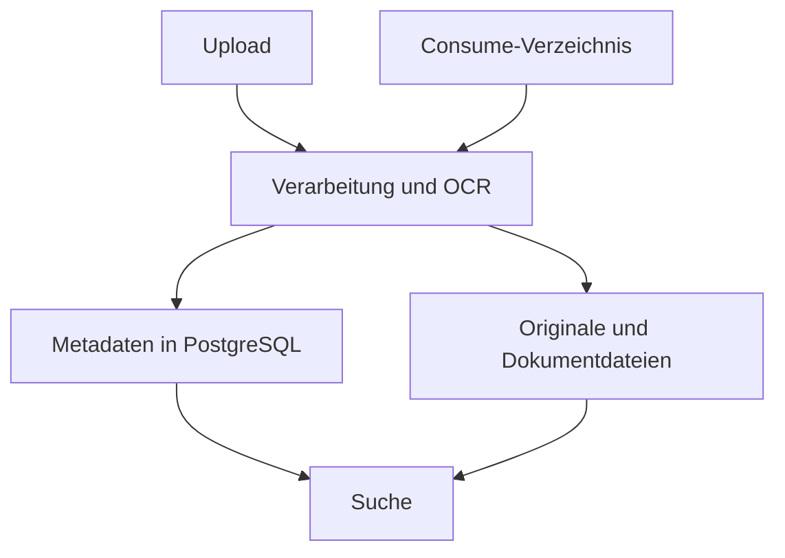

# Paperless-ngx

[Alle Dienste](../dienste.md) · [Schnellstart](../../SCHNELLSTART.md)

## Was macht der Dienst?

Paperless-ngx archiviert Dokumente und macht deren Inhalte durchsuchbar.
OCR ergänzt bei geeigneten Eingaben erkannten Text.
Tags, Dokumenttypen und weitere Metadaten helfen bei der Ablage.
Der Stack enthält PostgreSQL und Valkey neben der Anwendung.
Authentik ist als OIDC-Anbieter eingebunden.

## Einordnung in diesem Repository

| Punkt | Konfiguration |
|---|---|
| Stack-ID | `paperless` |
| Browseradresse | `https://paperless.<DOMAIN>` |
| Direkte Abhängigkeiten | [core](core.md) |
| Anmeldung | Forward Auth und OIDC |
| Deklarierte Dienstgruppen | `paperless-admins`, `paperless-users` |

`<DOMAIN>` steht für die bei der Einrichtung gewählte Basisdomain.
Abhängigkeiten werden vom Manager ergänzt; weitere indirekte Stacks können dazukommen.
Eine Dienstgruppe regelt den äußeren Zugang, nicht automatisch jede Berechtigung innerhalb der Anwendung.

## Bestandteile

| Compose-Service | Container-Image |
|---|---|
| `paperless` | `ghcr.io/paperless-ngx/paperless-ngx:${PAPERLESS_VERSION}` |
| `paperless-postgresql` | `postgres:${POSTGRES_VERSION}` |
| `paperless-valkey` | `valkey/valkey:${VALKEY_VERSION}` |

Image-Variablen werden aus der Stack-Konfiguration aufgelöst.
Die Tabelle beschreibt den Repository-Stand, keine Liste bereits gestarteter Container.

## Zusammenspiel



Das Diagramm zeigt die wesentlichen Beziehungen, nicht jede Netzwerkverbindung.

## Einrichten und starten

Den [Schnellstart](../../SCHNELLSTART.md) einmal für den Host durchführen.
Danach im Manager **Ersteinrichtung** beziehungsweise **Stack-Auswahl ändern** öffnen:

```bash
sudo .venv/bin/python compose/manage.py
```

`paperless` auswählen und die ermittelten Abhängigkeiten kontrollieren.
Vorhandene Werte werden wiederverwendet; neue Secrets gehören nicht in Git.
Erst nach erfolgreicher Einrichtung mit der Nutzung beginnen.

## Erste Nutzung

1. Mit einem berechtigten Benutzer die Paperless-Seite öffnen.
2. Ein unkritisches Testdokument hochladen oder in den Consume-Bereich geben.
3. Die Verarbeitung abwarten und den erkannten Text prüfen.
4. Passende Tags und einen Dokumenttyp vergeben.
5. Das Dokument über die Suche finden und erneut herunterladen.

## Wichtige Einstellungen

| Einstellung | Bedeutung |
|---|---|
| `PAPERLESS_VERSION` | Version der Dokumentenverwaltung. |
| `PAPERLESS_ADMIN_USER` | Initialer Administratorname. |
| `PAPERLESS_ADMIN_MAIL` | E-Mail des initialen Administrators. |
| `PAPERLESS_DB_NAME` | Name der PostgreSQL-Datenbank. |

Die vollständigen Eingaben stehen in [`.env.example`](../../compose/paperless/.env.example).
Normale Werte im Manager über **Konfiguration bearbeiten** ändern.
Passwortwechsel sind keine bloßen Textänderungen: Datei und laufender Dienst müssen zusammenpassen.

## Besonderheiten dieser Konfiguration

- OCR ist mit Deutsch und Englisch sowie Ausgabe als PDF/A voreingestellt.
- Der Consume-Bereich wird rekursiv verarbeitet; Unterverzeichnisse können als Tags dienen.
- Die Konfiguration erlaubt die SSO-Kontoanlage und synchronisiert Gruppen beim Login.
- Der Nutzerhook bearbeitet bestehende Konten; nicht jeder noch unbekannte Nutzer wird vorab lokal angelegt.
- Dokumentberechtigungen sind zusätzlich zu den äußeren Authentik-Gruppen zu beachten.
- Der konfigurierte initiale Paperless-Administrator ist von der normalen SSO-Nutzung zu unterscheiden.
- Ein leeres Consume-Verzeichnis nach erfolgreicher Verarbeitung bedeutet nicht automatisch Datenverlust.

## Daten und Sicherung

| Volume-Schlüssel | Tatsächlicher Volume-Name |
|---|---|
| `paperless_data` | `managed_paperless_data` |
| `paperless_media` | `managed_paperless_media` |
| `paperless_consume` | `managed_paperless_consume` |
| `paperless_export` | `managed_paperless_export` |
| `paperless_postgresql_data` | `managed_paperless_postgresql_data` |
| `paperless_valkey_data` | `managed_paperless_valkey_data` |

- PostgreSQL, Daten- und Medienvolume bilden den Kern der Sicherung.
- Noch nicht verarbeitete Dateien im Consume-Volume bei Bedarf einschließen.
- Ein Exportverzeichnis ist nur dann nützlich, wenn dort tatsächlich ein aktueller Export liegt.

Im Manager **Backups / Import / Export** öffnen und Stack, Service und Mounts auswählen.
Alle benötigten Services berücksichtigen; eine einzelne Service-Auswahl ist kein vollständiges Stack-Backup.
Der Manager hält betroffene Schreiber für Mount-Sicherungen an.
Konfiguration kann zusätzlich mit `age` verschlüsselt gesichert werden.
Vor einer Wiederherstellung Ziel-Mounts und vorhandene Daten prüfen.

## Wenn etwas nicht funktioniert

| Beobachtung | Zuerst prüfen |
|---|---|
| Dokument wird nicht verarbeitet | Aufgabenstatus, Valkey und Anwendungslogs prüfen. |
| Textsuche findet wenig | OCR-Ergebnis und Ausgangsqualität des Dokuments kontrollieren. |
| Nutzer sieht fremde oder keine Dokumente | Paperless-Berechtigungen und Gruppen prüfen. |
| SSO schlägt fehl | Provider-Konfiguration, Client-Secret und Callback prüfen. |

Für den Containerstatus und begrenzte Logs im Repository:

```bash
docker compose --project-directory compose/paperless --env-file compose/paperless/.env -p paperless -f compose/paperless/compose.yml ps
docker compose --project-directory compose/paperless --env-file compose/paperless/.env -p paperless -f compose/paperless/compose.yml logs --tail=80
```

Fehlt die `.env`, zuerst die Einrichtung abschließen.
Vor dem Weitergeben von Logs mögliche Zugangsdaten und persönliche Daten entfernen.

## Grenzen und weiterführende Dateien

Diese Seite beschreibt die vorhandene Konfiguration und ersetzt keinen Live-Test.
Ein erfolgreicher Compose-Check beweist weder SSO noch die vollständige Wiederherstellung.

- [Compose-Konfiguration](../../compose/paperless/compose.yml)
- [Stack-Metadaten und Hooks](../../compose/paperless/stack.py)
- [Gemeinsame Manager-Funktionen](../manager.md)
- [Ausstehende Betriebsprüfungen](../validierung.md)
